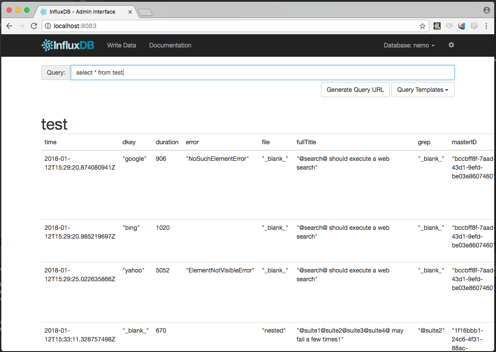
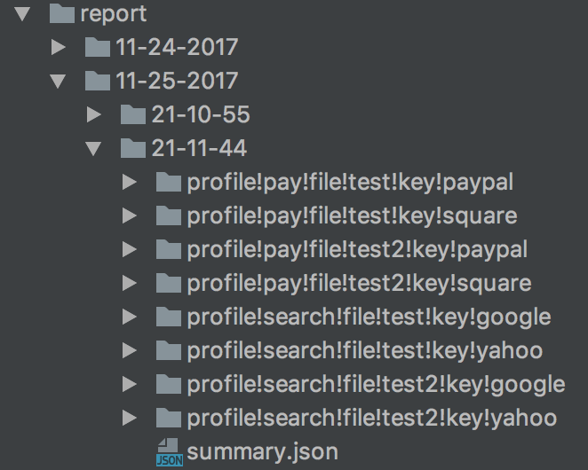

# nemo

[](https://greenkeeper.io/)

Node.js solution for running mocha-based selenium-webdriver tests.

## Getting started

Install nemo

```sh
npm install --save-dev nemo@^4
```

Use the scaffold feature

```bash
$ npx nemo -X test/functional

  DONE!

  Next steps:
  1. Make sure you have latest chrome/chromedriver installed (https://sites.google.com/a/chromium.org/chromedriver/getting-started)
     - The binary should be in your PATH
  2. Run nemo! "npx nemo"
  3. Look at nemo.config.js and test/functional/nemo.test.js
  4. Learn more: http://nemo.js.org

$

```

For a more complex, fully-featured suite:

```bash
$ ./node_modules/.bin/nemo -Z test/functional
```

## CLI arguments

```sh
$ ./bin/nemo --help

  Usage: _nemo [options]

  Options:

    -V, --version                output the version number
    -B, --base-directory <path>  parent directory for config/ and spec/ (or other test file) directories. relative to cwd
    -C, --config-file <path>       config file. can be JS or JSON
    -P, --profile [profile]      which profile(s) to run, out of the configuration
    -G, --grep <pattern>         only run tests matching <pattern>
    -F, --file                   run parallel by file
    -D, --data                   run parallel by data
    -S, --server                 run the nemo web server
    -L, --logging                info level logging (errors log by default)
    -X, --scaffold <path>          inject an example nemo suite under <path>
    -Z, --scaffold-complex <path>  inject a full-featured (complex) example nemo suite under <path>
    -U, --allow-unknown-args     allow command line arguments not specified by Nemo
    -E, --exit                   force shutdown of the event loop after test run: nemo will call process.exit
    --debug-brk                  enable node's debugger breaking on the first line
    --inspect                    activate devtools in chrome
    --no-timeouts                remove timeouts in debug/inspect use case
    -h, --help                   output usage information
```

## Configuration

You may either use the [confit](https://www.npmjs.com/package/confit) and [shortstop](https://www.npmjs.com/package/shortstop) powered, environment-aware configuration engine, or a plain JavaScript/JSON file.

Use the "complex scaffold" feature (`-Z`) to create a suite with this option.

### Plain JS/JSON

If using a plain JS/JSON file, you can add it as `nemo.config.json` or `nemo.config.js` in the directory you run nemo
from. Then you can run nemo simply as `./node_modules/.bin/nemo`. Nemo will find your configuration file automatically.

You can also specify a differently named or placed file using the `-C` option as `./node_modules/.bin/nemo -C
path/to/config/config.js`.

Use the "basic scaffold" feature (`-X`) to create a suite with this option.

## Profile options

### `output`

### `output.reports <optional>`

This convenience setting will create timestamped and tag-based directory structure for reports and
screenshots when you use [mochawesome](https://www.npmjs.com/package/mochawesome) or [xunit](https://mochajs.org/#xunit) reporters. When you use this, you can omit the specific
directory/filename settings for those reporters, as nemo will take care of that for you.

Recommended to set this as `path:report`, which will create a `report` directory beneath your base directory. See `Reporting` below.

### `output.storage <optional>`

You can provide an influxdb endpoint and store test results in it. E.g.

```js
"storage": {
    "server": "localhost",
    "database": "nemo"
}
```



Currently, you will get two measurements from running tests, `test` and `lifecycle`:

```js
schema: [{
  measurement: 'test',
  fields: {
    result: Influx.FieldType.STRING,
    error: Influx.FieldType.STRING,
    stack: Influx.FieldType.STRING,
    fullTitle: Influx.FieldType.STRING,
    duration: Influx.FieldType.INTEGER,
    threadID: Influx.FieldType.STRING,
    masterID: Influx.FieldType.STRING
  },
  tags: [
    'title',
    'profile',
    'dkey',
    'file',
    'grep'
  ]
},
{
  measurement: 'lifecycle',
  fields: {
    event: Influx.FieldType.STRING,
    threadID: Influx.FieldType.STRING,
    masterID: Influx.FieldType.STRING,
    duration: Influx.FieldType.INTEGER
  },
  tags: [
    'profile',
    'dkey',
    'grep'
  ]
}]
```

### `output.listeners <optional>`

The `output:listeners` property can resolve to a function, an Object, or an Array (or Array of
Arrays) of functions/objects.

The function form:
```js
module.exports = function (emitter) {
  emitter.on('test', (context, event) => {
    console.log(`another testlistener ${event.test.title} status: ${event.test.state}`);
  });
};
```

The Object form:
```
{
  type: 'pass',
  listener: (context, event) => {
    console.log(`user event listener: test passed ${JSON.stringify(event.tags)}`);
  }
}
```

Please see "Events" section for more details

### `base`

is the main profile configuration that others will merge into

### `base.tests`

is an absolute path based glob pattern. (e.g. `"tests": "path:spec/!(wdb)*.js",`)

### `base.parallel`

only valid for 'base'.

- if set to 'file' it will create a child process for each mocha file (alternative to `-F` CLI arg)
- if set to 'data' it will create a child process for each object key under `base.data` (alternative to the `-D` CLI arg)

### `base.mocha`

mocha options. described elsewhere

### `base.env`

any environment variables you want in the test process.

### `base.zeroExitCode`

-if set to true, nemo will always exit with zero code 
-if set to false, or don't set any value, the exitCode is Math.min(output.totals.fail, 255);


NOTES:
- currently `base.env` is only honored if nemo is launching parallel nemo instances (each as its own process).
If nemo launches a single nemo instance in the main process, these are ignored.
- any env variables in your nemo process will be merged into the env for the parallel processes
(along with whatever is set under `base.env`)

### `base.maxConcurrent`

a number which represents the max limit of concurrent suites nemo will execute in parallel - if not provided there is no limit

## Reporting

If you use either of the built-in reporters (`xunit` or `mochawesome`), `nemo` will generate
timestamped directories for each run. The reports will be further separated based on the parallel options. E.g.



In the above example, parallel options were "profile", "file", and "data".

A summary for all parallel instances can be found at `summary.json`

### Screenshots

You can use `nemo.snap()` at any point in a test, to grab a screenshot. These screenshots will be named based on
the respective test name, and number of screenshots taken using `nemo.snap()`. E.g.
- `my awesome test.1.png`
- `my awesome test.2.png`
- `my awesome test.3.png`

If you use the `mochawesome` reporter, you will see these screeshots in the `Additional Context` section of the html report.

If you are using `mochawesome` or `xunit` along with the `output.reports` setting, screenshots will be placed in the
appropriate output directory based on the instance details of the test which generated them.

## Adding Nemo into the mocha context and vice versa

nemo injects a `nemo` instance into the Mocha context (for it, before, after, etc functions) which can be accessed by
`this.nemo` within the test suites.

nemo also adds the current test's context to `nemo.mocha`. That can be useful if you want to access or modify the test's context from within a nemo plugin.

## Parallel functionality

nemo will execute in parallel `-P (profile)` x `-G (grep)` mocha instances. The example above uses "browser" as the
profile dimension and suite name as the "grep" dimension. Giving 2x2=4 parallel executions.

In addition to `profile` and `grep`, are the dimensions `file` and `data`.

### Parallel by `file`

`file` will multiply the existing # of instances by the # of files selected by your configuration.

### Parallel by `data`

`data` will multiply the existing # of instances by the # of keys found under `profiles.base.data`. It can also be overriden per-profile. It will also replace
 `nemo.data` with the value of each keyed object. In other words, you can use this to do parallel, data-driven testing.

If you have the following base profile configuration:

```js
  "profiles": {
    "base": {
      "data": {
        "US": {"url": "http://www.paypal.com"},
        "FR": {"url": "http://www.paypal.fr"}
      },
      "parallel": "data",
      "tests": "path:spec/test-spec.js",
      "mocha": {
        //...
      }
    }
  }
```

Then the following test will run twice (in parallel) with corresponding values of `nemo.data.url`:

```js
it('@loadHome@', function () {
    var nemo = this.nemo;
    return nemo.driver.get(nemo.data.url);//runs once with paypal.com, once with paypal.fr
});
```

### Parallel reporting

Using a reporter which gives file output will be the most beneficial. `nemo` comes out of the box, ready to use `mochawesome` or `xunit` for outputting a report per parallel instance.


## Mocha options

The properties passed in to the `"mocha"` property of `config.json` will be applied to the `mocha` instances that are created. In general, these properties correlate with the `mocha` command line arguments. E.g. if you want this:

```sh
mocha --timeout 180000
```

You should add this to the `"mocha"` property within `"profiles"` of `config.json`:

```json
"profile": {
	...other stuff,
	"mocha": {
		"timeout": 180000
	}
}
```

`nemo` creates `mocha` instances programmatically. Unfortunately, not all `mocha` command line options are available when instantiating it this way. One of the arguments that is **not** supported is the `--require` flag, which useful if you want to `require` a module, e.g. `babel-register` for transpilation. Thus, we added a `"require"` property in `config.json`, which takes a string of a single npm module name, or an array of npm module names. If it is an array, `nemo` will `require` each one before instantiating the `mocha` instances.

## Events

Nemo publishes lifecycle events which can help to monitor progress.

### `instance:start`

Published when an instance starts. The event is an object.

|Property|Type|Description|
|--- |--- |--- |
|tags|[`Tags{object}`](#tags)||

### `instance:end`

Published when an instance ends. The event is an [`InstanceResult`](#instanceresult) object.

### `master:end`

This event is published when all instances are completed. The event is an array of [`InstanceResult`](#instanceresult)
objects.

### `test`

This event is published at the conclusion of a test. The event is an object. You can use "uid" to correlate this event
with other test events from the same instance.

|Property|Type|Description|
|--- |--- |--- |
|tags|[`Tags{object}`](#tags)||
|test|[`TestResult`](#testresult)|modified Mocha test object (see elsewhere)|
|duration|`ms{number}`|Run duration for this test|


### `<custom events>`

You can publish custom events from within your tests using `nemo.runner.emit(EventType{string}[, EventPayload{object}])`

Nemo will publish this on the main event listener as the following object

|Property|Type|Description|
|--- |--- |--- |
|tags|[`Tags{object}`](#tags)||
|payload|`EventPayload{object}`|user defined, or empty object|

### Common event objects

#### `InstanceResult`

|Property|Type|Description|
|--- |--- |--- |
|tags|[`Tags{object}`](#tags)||
|testResults|[`TestResult[]`](#testresult)||
|duration|`ms{number}`|Run duration for this instance|

#### `TestResult`

Modified Mocha test object

|Property|Type|Description|
|--- |--- |--- |
|file|`{string}`|path to file containing this test|
|fullTitleString|`{string}`|Suite and test title concatenated|
|state|`{string}`|`passed` or `failed`|
|duration|`ms{number}`|Run duration for this test|

_Many other properties. Inspect in debugger for more information_

#### `Tags`

|Property|Type|Description|
|--- |--- |--- |
|profile|`{string}`|The profile which spawned this instance|
|uid|`{string}`|unique identifier for this instance|
|reportFile (optional)|`{string}`|path to report file for this instance (if generated)|
|grep (optional)|`{string}`|grep string, if provided|
|data (optional)|`{string}`|data key for this instance, if parallel by data is being used|

## Webdriver lifecycle options

`<profile>.driverPerTest`

Leave this unset, or set to false for a webdriver per Suite. Set to true for a webdriver per test

Example (find this in the test configuration):

```js
...
"driverPerSuite": {
    "tests": "path:./lifecycle.js",
    "driverPerTest": false,
    "mocha": {
        "grep": "@entireSuite@"
    }
},
"driverPerTest": {
    "tests": "path:./lifecycle.js",
    "driverPerTest": true,
    "mocha": {
        "grep": "@eachTest@"
    }
}
...
```

Please note: When using the `driverPerTest` option, there will be no `nemo` instance in the `before`/`after` lifecycle
context.

## Custom CLI Options (feature incomplete)

By default, Nemo will not accept CLI arguments that are not listed under [CLI Arguments](#cli-arguments)

Custom arguments can be useful for programmatically customizing Nemo configuration.

Use `-U` or `--allow-unknown-args` to prevent Nemo from validating CLI arguments

```sh
$ ./bin/nemo -U --myCustomArg myValue --anotherArg
```

_Further enhancement must be made in order to take advantage of custom arguments when running in parallel mode. Please
see https://github.com/krakenjs/nemo/issues/21_
